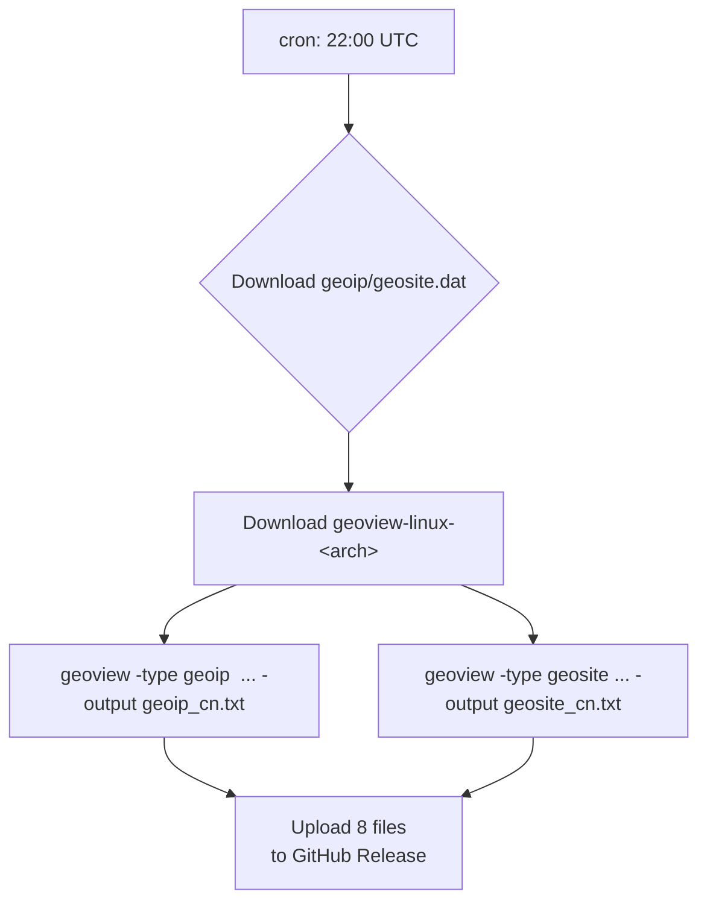

## GeoData Auto Generator

GeoData Auto Generator (GAG) 是一个 GitHub Actions-驱动的小型流水线，用来**每日自动产出适配 Xray-core 与 MosDNS 的 Geo 数据文件**。
工作流会在 UTC 22 点（北京时间 06 点）：

1. 拉取 **Loyalsoldier/v2ray-rules-dat** 的最新 `geoip.dat / geosite.dat`([github.com][1])；
2. 使用 **snowie2000/geoview** 工具逐一解析出 6 个纯文本规则文件（`geoip_cn.txt` 等）([github.com][2], [github.com][3])；
3. 将 2 个 `.dat` + 6 个 `.txt` 作为 *Release assets* 发布，供路由器或服务器脚本下载；
4. 在 RouterOS/Shell 脚本侧，把两类文件分别投喂给 **Xray**（需要重启）和 **MosDNS**（支持 `auto_reload` 热加载）完成更新。

---

### 引用与数据来源

| 角色                 | 仓库 / 文章                                           | 用途                                  |
| ------------------ | ------------------------------------------------- | ----------------------------------- |
| **Geo 数据源**        | \[Loyalsoldier/v2ray-rules-dat] ([github.com][1]) | 每日自动发布最新版 `geoip.dat / geosite.dat` |
| **解析工具**           | \[snowie2000/geoview] ([github.com][2])           | 将 `.dat` 拆分导出为可读 `.txt`             |
| **MosDNS V5 规则模板** | \[moreoronce/MosDNS-Config] ([github.com][4])     | 本仓库生成的 6 个 `.txt` 文件与其保持同名，开箱即用     |
| **规则解析原理 / 教程**    | 《自用无泄露 MosDNS 规则分享》([deeprouter.org][5])          | 介绍了 why & how of MosDNS geodata     |

---

### 为什么要拆出 6 个 `.txt`

* **MosDNS** 的 `data_providers` 插件可对单一 TXT 文件设置 `auto_reload: true`，文件更新后 1-2 秒即可热载入，无需重启服务。
* **Xray-core** 目前只认二进制 `geo*.dat`，且 **不会** 热加载——因此仍需定期重启 Xray 并替换 `.dat` 文件([github.com][4])。

---

### Actions 工作流概览



关键点：

* `permissions: contents: write` 赋予默认 `GITHUB_TOKEN` 发布 Release 的权限（解决 403 问题）([github.com][1])；
* 每个 TXT 单独执行一条 geoview 命令，避免 “多个 –output 被串联成一个文件名” 的坑。

---

### 典型部署示例

```bash
# RouterOS Scheduler 每天 07:00 更新
/container start geo-updater
:delay 40s
/file copy /docker/geodata/geoip.dat   /docker/xray/usr/local/share/xray/
:file copy /docker/geodata/geosite.dat /docker/xray/usr/local/share/xray/
/container stop  geo-updater
/container restart xray          # 必须重启
# MosDNS 挂载 /docker/geodata -> /var/mosdns 并在 config.yaml 中 auto_reload: true
```

示例 `data_providers` 片段：

```yaml
- tag: geosite-cn
  file: /var/mosdns/geosite_cn.txt
  auto_reload: true
```

MosDNS 检测到 TXT 文件变动后 1 秒左右即完成热更新，无需重启服务。

---

### 参考阅读

* 《自用无泄露 MosDNS 规则分享》([deeprouter.org][5])
* Deep Router 系列文章对 DNS 泄露场景与修复流程的深入讨论([deeprouter.org][6])

---

### License & Credits

* geodata 原始内容版权归 **Loyalsoldier/v2ray-rules-dat** 作者所有。
* TXT 规则命名方案与分流思路来自 **moreoronce/MosDNS-Config** 项目及原作者 DeepRouter 文章。
* 本仓库脚本仅做自动化打包，遵循 MIT License 共享。

> “让规则更新不再手动，专注于配置本身” —— GeoData Auto Generator 期待为你省去最后一丝琐碎。

[1]: https://github.com/Loyalsoldier/v2ray-rules-dat?utm_source=chatgpt.com "Loyalsoldier/v2ray-rules-dat: V2Ray 路由规则文件加强版，可 ..."
[2]: https://github.com/snowie2000/geoview?utm_source=chatgpt.com "snowie2000/geoview: A handy tool to extract information ... - GitHub"
[3]: https://github.com/snowie2000/geoview/blob/master/README.md?utm_source=chatgpt.com "README.md - snowie2000/geoview - GitHub"
[4]: https://github.com/xiaomqw?utm_source=chatgpt.com "xiaomqw - GitHub"
[5]: https://deeprouter.org/article/mosdns-config-with-no-leak?utm_source=chatgpt.com "自用无泄露MosDNS规则分享 - Deep Router"
[6]: https://deeprouter.org/article/dae-adguard-home-guide?utm_source=chatgpt.com "Dae搭配AdGuard Home使用指南 - Deep Router"
